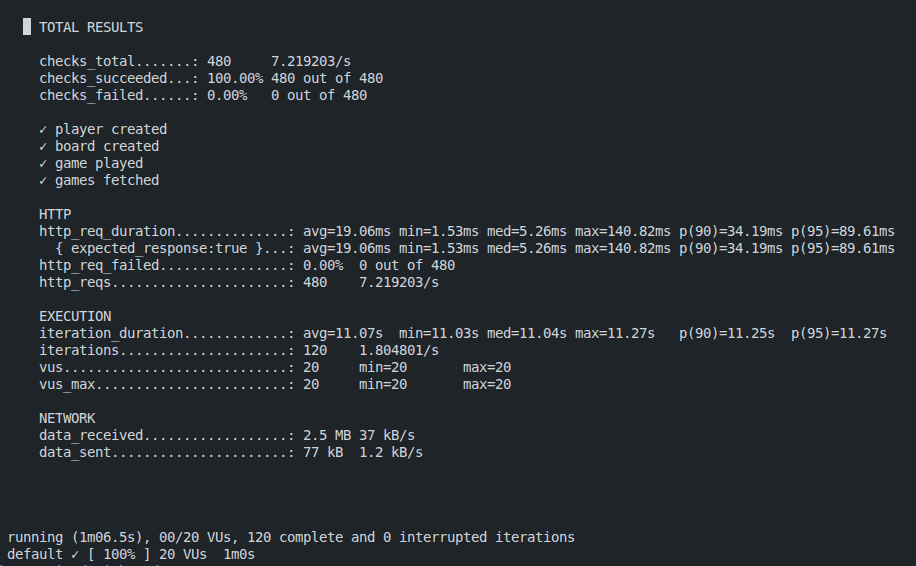

# Dungeon Game API

## Prerequisites

1. PostgreSQL database running on localhost:5432
2. Create database: `CREATE DATABASE dungeon;`
3. Configure environment variables (see Configuration section below)

## Configuration

This project uses environment variables for configuration. You can set them up in two ways:

### Option 1: Using .env file (Recommended for development)

1. Copy the example environment file:

```bash
cp .env.example .env
```

2. Edit `.env` with your database credentials:

```
DB_URL=jdbc:postgresql://localhost:5432/dungeon
DB_USERNAME=your_username
DB_PASSWORD=your_password
```

### Option 2: System environment variables

Export the variables in your shell:

```bash
export DB_URL=jdbc:postgresql://localhost:5432/dungeon
export DB_USERNAME=your_username
export DB_PASSWORD=your_password
```

## Running the Application

### Option 1 - java spring

```bash
mvn spring-boot:run
```

### Option 2 - docker compose

```bash
docker-compose up --build -d
```

## API Endpoints

### Players API

#### Create a Player

```bash
curl -X POST http://localhost:8080/api/players \
  -H "Content-Type: application/json" \
  -d '{"name":"John Doe","email":"john@example.com"}'
```

#### Get All Players

```bash
curl http://localhost:8080/api/players
```

#### Get Player by ID

```bash
curl http://localhost:8080/api/players/1
```

#### Update Player

```bash
curl -X PUT http://localhost:8080/api/players/1 \
  -H "Content-Type: application/json" \
  -d '{"name":"John Smith","email":"johnsmith@example.com"}'
```

#### Delete Player

```bash
curl -X DELETE http://localhost:8080/api/players/1
```

### Boards API

#### Create a Board

```bash
curl -X POST http://localhost:8080/api/boards \
  -H "Content-Type: application/json" \
  -d '{"name":"Easy Dungeon","board":[[-2,-3,3],[-5,-10,1],[10,30,-5]]}'
```

#### Get All Boards

```bash
curl http://localhost:8080/api/boards
```

#### Get Board by ID

```bash
curl http://localhost:8080/api/boards/1
```

#### Update Board

```bash
curl -X PUT http://localhost:8080/api/boards/1 \
  -H "Content-Type: application/json" \
  -d '{"name":"Updated Dungeon","board":[[-1,-2,2],[-3,-8,1],[5,20,-3]]}'
```

#### Delete Board

```bash
curl -X DELETE http://localhost:8080/api/boards/1
```

### Games API

#### Play a Game

```bash
curl -X POST http://localhost:8080/api/games/play \
  -H "Content-Type: application/json" \
  -d '{"playerId":1,"boardId":1}'
```

#### Get All Games

```bash
curl http://localhost:8080/api/games
```

#### Get Game by ID

```bash
curl http://localhost:8080/api/games/1
```

#### Get Games by Player

```bash
curl http://localhost:8080/api/games/player/1
```

#### Get Games by Board

```bash
curl http://localhost:8080/api/games/board/1
```

## Sample Workflow

1. Create a player:

```bash
curl -X POST http://localhost:8080/api/players \
  -H "Content-Type: application/json" \
  -d '{"name":"Alice","email":"alice@example.com"}'
```

2. Create a board:

```bash
curl -X POST http://localhost:8080/api/boards \
  -H "Content-Type: application/json" \
  -d '{"name":"Test Dungeon","board":[[-2,-3,3],[-5,-10,1],[10,30,-5]]}'
```

3. Play the game:

```bash
curl -X POST http://localhost:8080/api/games/play \
  -H "Content-Type: application/json" \
  -d '{"playerId":1,"boardId":1}'
```

Expected response:

```json
{
  "gameId": 1,
  "playerName": "Alice",
  "boardName": "Test Dungeon",
  "minimumHealth": 7
}
```

## Run the stress tests

**Build the containers**

```bash
docker-compose up --build -d
```

**Run the stress tests with the K6**

```bash
docker-compose up --build k6
```

**Cleanup**

```bash
docker-compose down -v --remove-orphans
ocker system prune -af --volumes
```

## Results


