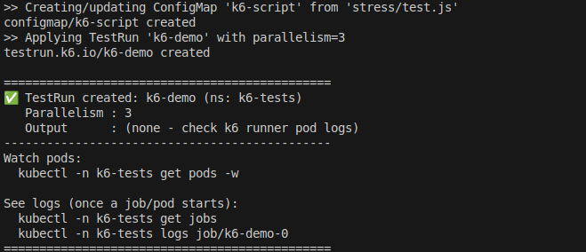
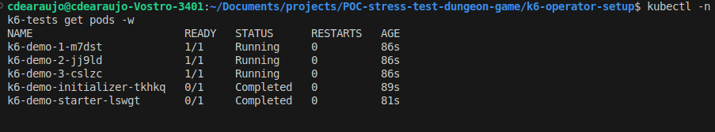
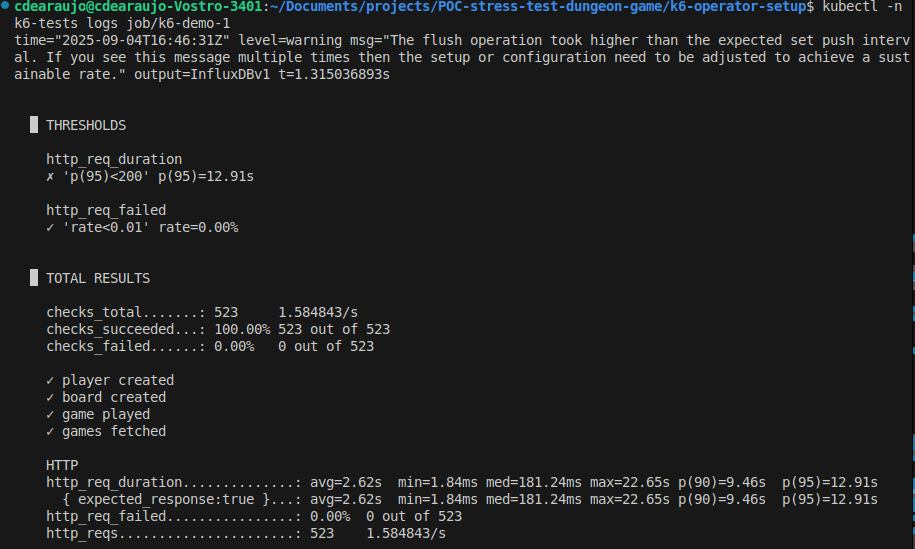
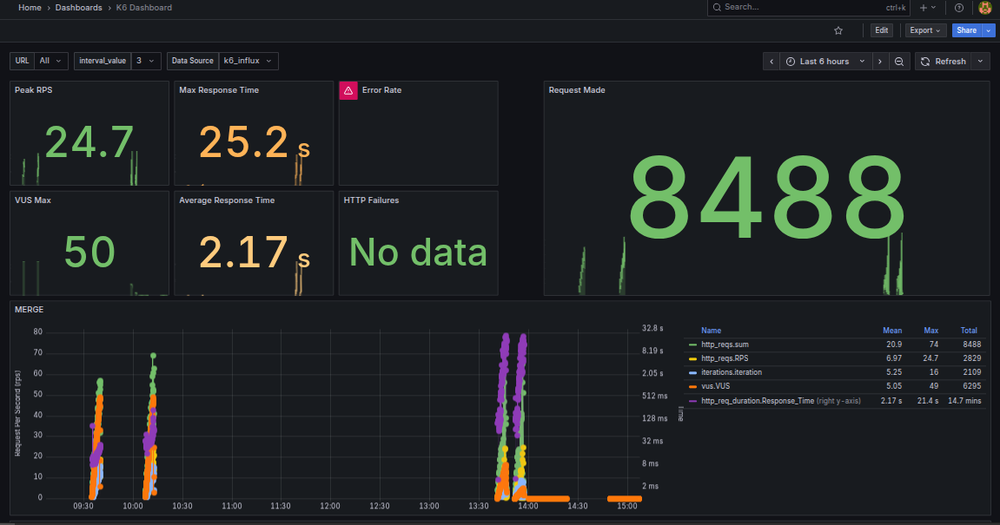
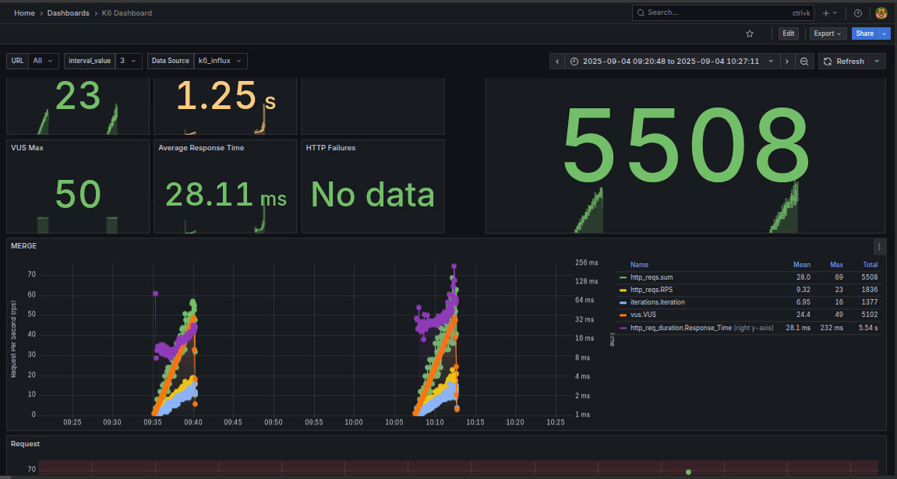
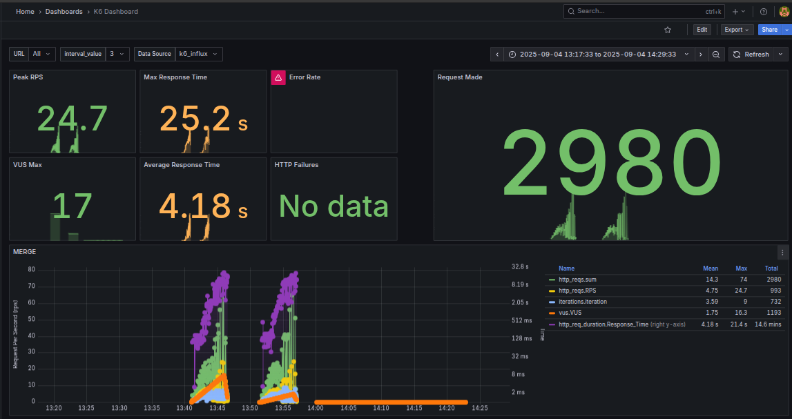

# k6-operator local (Kind) — Quick Setup

This package creates a Kind cluster (if it does not exist), installs the k6-operator,
publishes your script `stress/test.js` as a ConfigMap, and applies a TestRun
with 3 instances (pods) of k6 running in parallel.

## Structure
```
k6-operator-setup/
├─ setup-k6.sh
└─ manifests/
   └─ testrun.tmpl.yaml
```

> Your test script should be located at: `./stress/test.js` (project root).

## Requirements
- kubectl
- kind
- curl
- envsubst (from gettext package)

## Usage
```bash
cd k6-operator-setup/
chmod +x setup-k6.sh
./setup-k6.sh
```

Optional environment variables:
```bash
TARGET_URL="http://host.docker.internal:8080/health"     INFLUX_URL="http://host.docker.internal:8086/k6"     PARALLELISM=3     NAMESPACE="k6-tests"     ./setup-k6.sh
```

Monitor status/logs:
```bash
kubectl -n k6-tests get pods -w
kubectl -n k6-tests get jobs
kubectl -n k6-tests logs job/k6-demo-1
```

# Screenshots

## Final output after run setup-k6.sh script


## Checking jobs statuses


## Checking logs from specif pod Demo-1


## Grafana Output


## Stress test 2 time by docker-compose setup



## Stress test 2 time by Kubernetes with k6-operator



# Notes

Why did you see fewer logs in Kubernetes compared to the service run by docker-compose?

## Parallelism ≠ Multiply Load
In k6-operator, parallelism: 3 divides the same test into 3 segments (execution segments). Each pod runs 1/3 of the plan, not 3x more. So, with the same options.stages script, the approximate total number of requests remains the same (or even lower due to overhead), not tripled.

## Limits/Overhead
In the YAML, we defined limits: cpu: "1" per runner. In docker-compose, k6 probably had more CPU available. With high latency (its p95 was ~5.6s) and sleep(10) inside the loop, any CPU/network limit reduces throughput.

## Network
In compose, k6 talks to the app "within" the same docker network. In the cluster it goes out via 172.19.0.1 (hairpin/NAT), it usually adds latency.


## Longer network path and NAT
In compose, k6 talks to the app via a local bridge. In Kind, pods exit through the kind network gateway (172.19.0.1), pass through NAT/conntrack/iptables, and enter compose → +RTT and jitter.

## DNS within the cluster
You call http://app:8080 in the script. This resolves via CoreDNS to a Service+Endpoints that points to the host. Any DNS fluctuation results in extra latency. (You've seen "server misbehaving" before.)

## CPU Throttling on Runners
In the template, we define requests: 500m and limits: 1. If your machine is busy (Kind + compose + Grafana + Influx + app + Postgres), throttling causes "tails" (p95/p99).

## Heavy Test Load
Your default() creates a player, board (with a random array), and game, and also GETs /api/games at each iteration. That's a lot of CPU work and database IO per request. Any limitations in Postgres (or the app's pool) show up as delays.

## Output to Influx
Saving metrics to http://172.19.0.1:8086 also uses the same NAT path. Under high load, this adds overhead (minor, but still present).